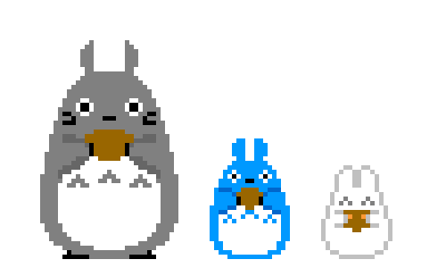

# Study-Projects

    
    In this repository I show the smalls projects which I have worked to expand my knowledge during my time at the university with the idea of improving and increasing my knowledge in programming.

---

I enjoy learning new programming languages and hope to learn more in the future. I believe technology can bring lots of exitment, advances, and fun for the future generations and hope to be part of does who make it possible.
